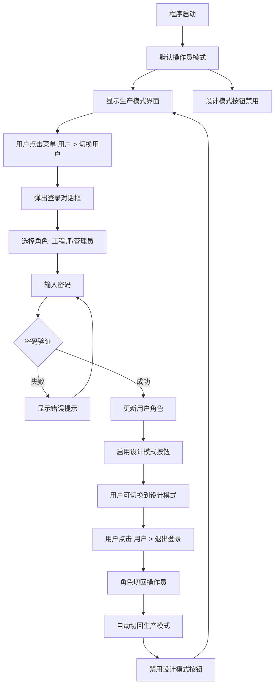

# 用户设置菜单实施计划

## 需求概述

在菜单栏中新增一个「用户」菜单，实现操作员/工程师/管理员三种角色的权限控制：

- **操作员模式**（默认）：程序启动默认为操作员，无需登录，只能使用生产模式界面
- **工程师模式**：通过「用户」菜单中的「切换用户」功能，以工程师或管理员身份登录后，开放设计模式界面
- **退出登录**：退出到操作员模式，自动切回生产模式

---

## 涉及文件

| 文件 | 修改内容 |
|------|----------|
| [`ui/main_window.py`](ui/main_window.py) | 新增「用户」菜单、登录对话框、权限控制逻辑 |
| [`data/users.json`](data/users.json) | 无需修改（已有用户数据） |

---

## 实施步骤

### 步骤 1：在 [`ui/main_window.py`](ui/main_window.py) 中新增密码验证工具函数

在文件顶部（`import` 区域之后、类定义之前），添加一个密码验证函数：

```python
import hashlib
import json
from core.paths import USERS_FILE

def _verify_password(input_password: str, stored_hash: str) -> bool:
    """验证密码：对输入密码进行 SHA256 哈希，与存储的哈希值比对"""
    return hashlib.sha256(input_password.encode('utf-8')).hexdigest() == stored_hash

def _load_users() -> dict:
    """加载 users.json 中的用户数据"""
    try:
        with open(USERS_FILE, 'r', encoding='utf-8') as f:
            return json.load(f)
    except Exception:
        return {}
```

### 步骤 2：在 [`MainWindow.__init__`](ui/main_window.py:90) 中新增用户状态属性

在 `__init__` 方法中（现有属性之后），添加：

```python
self._current_user_role = "operator"      # 当前用户角色: operator / engineer / admin
self._current_user_name = "操作员"         # 当前用户显示名称
```

### 步骤 3：在 [`_setup_menu_bar`](ui/main_window.py:645) 中新增「用户」菜单

在现有菜单（设备、方案、通信、视图、系统、帮助）之后，新增一个「用户」菜单：

```python
# ── 用户菜单 ──
user_menu = menubar.addMenu("用户")

self.act_current_user = QAction("当前用户：操作员", self)
self.act_current_user.setEnabled(False)  # 仅显示，不可点击

self.act_switch_user = QAction("切换用户...", self)
self.act_switch_user.triggered.connect(self._show_login_dialog)

self.act_logout = QAction("退出登录", self)
self.act_logout.triggered.connect(self._logout)

user_menu.addAction(self.act_current_user)
user_menu.addSeparator()
user_menu.addAction(self.act_switch_user)
user_menu.addAction(self.act_logout)
```

### 步骤 4：实现 [`_show_login_dialog`](ui/main_window.py) 登录对话框

新增方法，弹出登录对话框：

```python
def _show_login_dialog(self):
    """弹出登录对话框，选择角色并输入密码"""
    dialog = QDialog(self)
    dialog.setWindowTitle("登录")
    dialog.setFixedSize(360, 220)
    dialog.setStyleSheet("""
        QDialog { background-color: #2d2d2d; }
        QLabel { color: #d4d4d4; font-size: 14px; }
        QComboBox, QLineEdit { 
            background-color: #3c3c3c; color: #d4d4d4; 
            border: 1px solid #555; border-radius: 3px; 
            padding: 6px 10px; font-size: 14px;
        }
        QPushButton {
            background-color: #1a3a5c; color: #4A90D9;
            border: 1px solid #2a5a8c; border-radius: 3px;
            padding: 8px 24px; font-size: 14px; font-weight: bold;
        }
        QPushButton:hover { background-color: #2a4a7c; }
    """)
    
    layout = QVBoxLayout(dialog)
    layout.setSpacing(12)
    layout.setContentsMargins(20, 20, 20, 20)
    
    # 角色选择
    role_layout = QHBoxLayout()
    role_layout.addWidget(QLabel("登录为："))
    role_combo = QComboBox()
    role_combo.addItem("工程师", "engineer")
    role_combo.addItem("管理员", "admin")
    role_layout.addWidget(role_combo, 1)
    layout.addLayout(role_layout)
    
    # 密码输入
    pwd_layout = QHBoxLayout()
    pwd_layout.addWidget(QLabel("密  码："))
    pwd_input = QLineEdit()
    pwd_input.setEchoMode(QLineEdit.Password)
    pwd_input.returnPressed.connect(lambda: _do_login())
    pwd_layout.addWidget(pwd_input, 1)
    layout.addLayout(pwd_layout)
    
    # 错误提示
    error_label = QLabel("")
    error_label.setStyleSheet("color: #ff5252; font-size: 12px;")
    error_label.setAlignment(Qt.AlignCenter)
    layout.addWidget(error_label)
    
    # 按钮
    btn_layout = QHBoxLayout()
    btn_layout.addStretch()
    btn_login = QPushButton("登录")
    btn_cancel = QPushButton("取消")
    btn_cancel.setStyleSheet("""
        QPushButton { background-color: #3c3c3c; color: #d4d4d4; 
                       border: 1px solid #555; }
        QPushButton:hover { background-color: #4a4a4a; }
    """)
    btn_layout.addWidget(btn_login)
    btn_layout.addWidget(btn_cancel)
    layout.addLayout(btn_layout)
    
    def _do_login():
        role_key = role_combo.currentData()
        password = pwd_input.text()
        if not password:
            error_label.setText("请输入密码")
            return
        
        users = _load_users()
        user_info = users.get(role_key)
        if user_info and _verify_password(password, user_info["password_hash"]):
            self._set_user_role(role_key, user_info["display_name"])
            dialog.accept()
        else:
            error_label.setText("密码错误，请重试")
            pwd_input.clear()
            pwd_input.setFocus()
    
    btn_login.clicked.connect(_do_login)
    btn_cancel.clicked.connect(dialog.reject)
    
    dialog.exec_()
```

### 步骤 5：实现 [`_set_user_role`](ui/main_window.py) 和 [`_logout`](ui/main_window.py) 方法

```python
def _set_user_role(self, role: str, display_name: str):
    """设置当前用户角色，更新 UI 状态"""
    self._current_user_role = role
    self._current_user_name = display_name
    
    # 更新菜单显示
    self.act_current_user.setText(f"当前用户：{display_name}")
    
    # 如果角色是 engineer 或 admin，启用设计模式
    is_engineer = role in ("engineer", "admin")
    self.btn_engineer_mode.setEnabled(is_engineer)
    self.act_switch_engineer.setEnabled(is_engineer)
    
    # 如果当前在设计模式但角色不是工程师，切回生产模式
    if not is_engineer and self.stack.currentIndex() == 1:
        self._switch_mode(0)
    
    log_info(f"用户切换: {display_name}({role})")

def _logout(self):
    """退出登录，回到操作员模式"""
    self._set_user_role("operator", "操作员")
    self.status_label.setText("生产模式")
```

### 步骤 6：修改 [`_setup_mode_toolbar`](ui/main_window.py:156) 初始化状态

在 `_setup_mode_toolbar` 方法中，初始化时禁用设计模式按钮：

在 `self.btn_engineer_mode.setCheckable(True)` 之后添加：
```python
self.btn_engineer_mode.setEnabled(False)  # 默认操作员模式，禁用设计模式
```

### 步骤 7：修改 [`_switch_mode`](ui/main_window.py:211) 方法

在 `_switch_mode` 方法开头添加权限检查：

```python
def _switch_mode(self, index: int):
    # 如果尝试切换到设计模式但当前用户不是工程师/管理员，阻止切换
    if index == 1 and self._current_user_role not in ("engineer", "admin"):
        QMessageBox.warning(self, "权限不足", "请先通过「用户」菜单登录工程师账号")
        # 保持当前模式选中状态
        self.btn_worker_mode.setChecked(True)
        self.btn_engineer_mode.setChecked(False)
        return
    
    self.stack.setCurrentIndex(index)
    self.btn_worker_mode.setChecked(index == 0)
    self.btn_engineer_mode.setChecked(index == 1)
    
    if index == 0:
        self.status_label.setText("生产模式")
    else:
        self.status_label.setText("设计模式")
```

---

## 流程图



---

## 注意事项

1. **密码哈希算法**：`users.json` 中存储的是 SHA256 哈希值，验证时需要对输入密码做同样的哈希处理
2. **操作员密码**：`operator` 用户虽然也有密码哈希，但操作员无需登录，直接进入系统
3. **菜单项状态**：`退出登录` 菜单项在操作员模式下应禁用（已在操作员时不可点击），工程师/管理员登录后启用
4. **工具栏同步**：工具栏上的设计模式按钮与菜单中的「视图 > 设计模式」应同步禁用/启用
5. **日志记录**：用户切换操作应记录到日志中，便于审计
